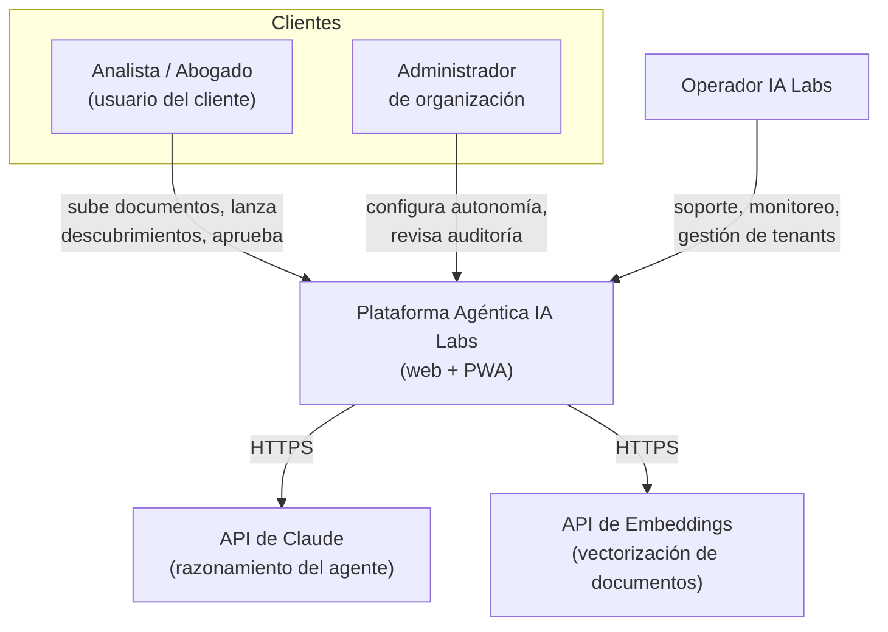
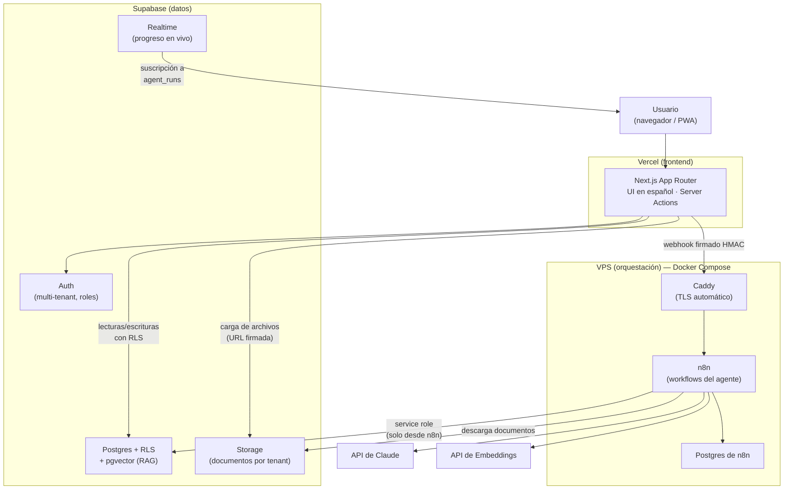
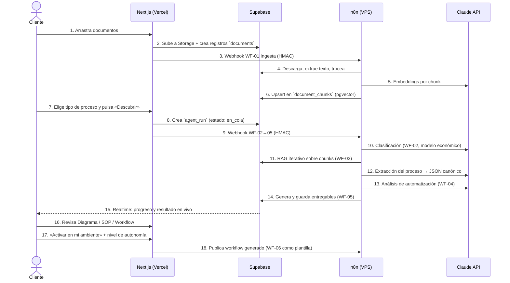

# 01 — Arquitectura Técnica

**Versión:** 1.0 (Piloto) · Agosto 2026
**Principio rector:** el mínimo de piezas que cumple el propósito — simple de operar, barata de mantener, disponible 24/7.

---

## 1. Vista de contexto (C4 — Nivel 1)

## 2. Vista de contenedores (C4 — Nivel 2)

Cuatro piezas. Cada una tiene un solo responsable de su clase de problema.

### Responsabilidades por pieza

| Pieza | Responsabilidad | Lo que NO hace |
|---|---|---|
| **Next.js en Vercel** | UI, autenticación de sesión, lecturas/escrituras directas a Supabase bajo RLS, disparo de webhooks a n8n | No ejecuta lógica de agente ni llama a LLMs |
| **Supabase** | Fuente de verdad: datos, documentos, vectores, auth, tiempo real | No orquesta procesos |
| **n8n en VPS** | Toda la lógica agéntica: ingesta, RAG, descubrimiento, análisis, generación de entregables, ejecución gobernada | No sirve UI ni guarda datos de negocio (solo su propio estado) |
| **APIs de IA** | Claude (razonamiento) y embeddings (vectorización) | — |

## 3. Flujo principal: descubrimiento de un proceso

## 4. Decisiones de arquitectura (ADR resumidas)

### ADR-1: Sin backend dedicado
**Decisión:** no hay servidor de API propio; el "backend" son Server Actions de Next.js + políticas RLS de Supabase + workflows n8n.
**Razón:** cada pieza extra es costo de mantenimiento y superficie de fallo. La lógica de negocio ligera (CRUD con permisos) vive en RLS; la lógica pesada (agente) vive en n8n.
**Consecuencia:** si en producción aparece lógica que no encaja en ninguno de los dos, se evalúa Supabase Edge Functions antes que un servidor propio.

### ADR-2: pgvector en lugar de vector DB dedicada
**Decisión:** los embeddings viven en Postgres (extensión pgvector de Supabase), no en Pinecone/Weaviate/Qdrant.
**Razón:** el piloto maneja miles-decenas de miles de chunks por tenant, muy por debajo del punto donde pgvector deja de rendir. Una base de datos menos que operar, pagar y asegurar; y los vectores quedan bajo las mismas políticas RLS que el resto de datos del tenant.
**Consecuencia:** si un tenant supera ~1–2 millones de vectores, se evalúa índice HNSW dedicado o migración parcial.

### ADR-3: n8n self-hosted en VPS, no n8n Cloud
**Decisión:** n8n corre en un VPS propio (Hetzner/DigitalOcean/Railway, 2 vCPU / 4 GB RAM) con Docker Compose: `n8n` + `postgres` (estado de n8n) + `caddy` (TLS automático).
**Razón:** sin límite de ejecuciones (crítico para "capacidad operativa continua"), costo fijo bajo (~USD 10–20/mes), y los documentos del cliente no transitan por la nube de un tercero adicional — relevante para confidencialidad legal.
**Consecuencia:** IA Labs asume backups y actualizaciones (runbook en [06-costos-y-operacion.md](06-costos-y-operacion.md)).

### ADR-4: Sin Kubernetes, sin microservicios
**Decisión:** monolito modular en cada pieza.
**Razón:** el piloto tiene un solo equipo pequeño y decenas-cientos de ejecuciones/día. Kubernetes y microservicios resuelven problemas de escala organizacional y de tráfico que no existen aquí; su costo de operación violaría el principio de eficiencia económica.
**Consecuencia:** el camino de escala es vertical primero (VPS más grande, n8n en modo `queue` con workers) — ver [07-roadmap-piloto-a-produccion.md](07-roadmap-piloto-a-produccion.md).

### ADR-5: Modelos de IA
**Decisión:**
- **Razonamiento del agente** (descubrimiento, análisis, generación): `claude-sonnet-5` — mejor relación calidad/costo para extracción estructurada y generación de workflows.
- **Clasificación y tareas simples:** `claude-haiku-4-5` — ~10x más barato, suficiente para clasificar tipo de proceso y filtrar chunks.
- **Embeddings:** el piloto necesita un proveedor de embeddings aparte (Claude no ofrece embeddings). Comparativa:

| Proveedor / modelo | Dimensiones | Costo por 1M tokens | Nota |
|---|---|---|---|
| OpenAI `text-embedding-3-small` | 1536 | ~USD 0.02 | **Elección del piloto**: barato, estable, soporte nativo en n8n |
| Voyage `voyage-3.5-lite` | 1024 | ~USD 0.02 | Alternativa; mejor en algunos benchmarks legales |
| Cohere `embed-v4` | 1536 | ~USD 0.12 | Multilingüe fuerte, más caro |

**Consecuencia:** la columna `embedding` se define `vector(1536)`; cambiar de proveedor implica re-vectorizar (operación batch en WF-01, aceptable).

### ADR-6: PWA en lugar de app nativa
**Decisión:** la "app" del piloto es la misma web Next.js instalable como PWA.
**Razón:** un solo código, cero fricción de tiendas de aplicaciones, suficiente para el caso de uso (subir documentos, revisar entregables, aprobar pasos).
**Consecuencia:** notificaciones push web para aprobaciones pendientes (L2) se agregan en fase de producción.

## 5. Ambientes

| Ambiente | Frontend | Supabase | n8n |
|---|---|---|---|
| **Desarrollo** | Vercel preview + localhost | Proyecto Supabase `dev` (o branch) | n8n local (Docker) o carpeta `dev` en el VPS |
| **Piloto/Producción** | Vercel producción (dominio de IA Labs) | Proyecto Supabase `prod` | VPS con carpeta `prod` |

Regla: los workflows n8n se desarrollan y prueban en `dev`, se exportan como JSON versionado (Git) y se publican a `prod`. Nunca se edita directamente en producción.

## 6. Comunicación entre piezas y seguridad de red

- **Frontend → Supabase:** SDK oficial con llave `anon` + RLS. La llave `service_role` **nunca** llega al navegador.
- **Frontend → n8n:** webhooks HTTPS con firma **HMAC-SHA256** (secreto compartido en Vercel env y credencial n8n) + `organization_id` y `run_id` en el payload. n8n rechaza cualquier webhook sin firma válida.
- **n8n → Supabase:** llave `service_role` guardada como credencial n8n (cifrada en reposo). n8n valida el tenant en cada operación (defensa en profundidad además de la firma).
- **VPS:** solo puertos 80/443 expuestos (Caddy); n8n y su Postgres solo en la red interna de Docker. Acceso SSH con llave, sin contraseña. UI de n8n protegida con autenticación propia + 2FA.

Detalle completo de gobernanza y seguridad en [05-gobernanza-y-seguridad.md](05-gobernanza-y-seguridad.md).
