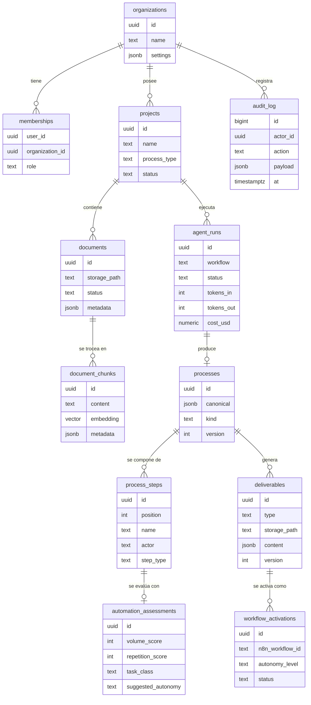

# 02 — Modelo de Datos

**Versión:** 1.0 (Piloto) · Agosto 2026
**Base:** Supabase (Postgres 15+, extensión `pgvector`). Todas las tablas de negocio llevan `organization_id` y RLS activado.

---

## 1. Diagrama entidad-relación



## 2. Tablas

### 2.1 Identidad y tenancy

```sql
create table organizations (
  id          uuid primary key default gen_random_uuid(),
  name        text not null,
  slug        text unique not null,
  -- techo de autonomía que el admin permite en toda la org: 'L0'|'L1'|'L2'|'L3'
  max_autonomy text not null default 'L2',
  settings    jsonb not null default '{}',
  created_at  timestamptz not null default now()
);

create table memberships (
  user_id         uuid not null references auth.users(id) on delete cascade,
  organization_id uuid not null references organizations(id) on delete cascade,
  role            text not null check (role in ('admin','member','ialabs_operator')),
  created_at      timestamptz not null default now(),
  primary key (user_id, organization_id)
);
```

### 2.2 Proyectos y documentos

```sql
create table projects (
  id              uuid primary key default gen_random_uuid(),
  organization_id uuid not null references organizations(id) on delete cascade,
  name            text not null,
  -- taxonomía del piloto legal; 'auto' = que el agente lo detecte
  process_type    text not null default 'auto'
                  check (process_type in ('auto','intake_casos','revision_contratos','respuesta_requerimientos','otro')),
  status          text not null default 'activo' check (status in ('activo','archivado')),
  created_by      uuid not null references auth.users(id),
  created_at      timestamptz not null default now()
);

create table documents (
  id              uuid primary key default gen_random_uuid(),
  organization_id uuid not null references organizations(id) on delete cascade,
  project_id      uuid not null references projects(id) on delete cascade,
  filename        text not null,
  storage_path    text not null,          -- bucket segregado por organización
  mime_type       text,
  size_bytes      bigint,
  status          text not null default 'subido'
                  check (status in ('subido','procesando','indexado','error','ilegible')),
  error_detail    text,
  metadata        jsonb not null default '{}',
  created_at      timestamptz not null default now()
);

create table document_chunks (
  id              uuid primary key default gen_random_uuid(),
  organization_id uuid not null references organizations(id) on delete cascade,
  document_id     uuid not null references documents(id) on delete cascade,
  chunk_index     int  not null,
  content         text not null,
  embedding       vector(1536),           -- text-embedding-3-small (ver ADR-5)
  metadata        jsonb not null default '{}',  -- página, sección, encabezados
  unique (document_id, chunk_index)
);

-- Índice vectorial (HNSW: buen equilibrio recall/latencia para el piloto)
create index on document_chunks using hnsw (embedding vector_cosine_ops);
create index on document_chunks (organization_id, document_id);
```

### 2.3 Ejecuciones del agente

```sql
create table agent_runs (
  id              uuid primary key default gen_random_uuid(),
  organization_id uuid not null references organizations(id) on delete cascade,
  project_id      uuid not null references projects(id) on delete cascade,
  workflow        text not null,          -- 'WF-01' .. 'WF-06'
  status          text not null default 'en_cola'
                  check (status in ('en_cola','ejecutando','completado','error','cancelado')),
  -- progreso legible para la UI en vivo (Supabase Realtime escucha esta tabla)
  progress_step   text,                   -- ej. 'Extrayendo actividades (3/7 documentos)'
  progress_pct    int not null default 0,
  tokens_in       int not null default 0,
  tokens_out      int not null default 0,
  cost_usd        numeric(10,4) not null default 0,
  error_detail    text,
  n8n_execution_id text,                  -- trazabilidad hacia n8n
  started_at      timestamptz,
  finished_at     timestamptz,
  created_at      timestamptz not null default now()
);
```

### 2.4 Procesos descubiertos

```sql
create table processes (
  id              uuid primary key default gen_random_uuid(),
  organization_id uuid not null references organizations(id) on delete cascade,
  project_id      uuid not null references projects(id) on delete cascade,
  agent_run_id    uuid references agent_runs(id),
  name            text not null,
  process_type    text not null,
  -- 'as_is' = reconstruido desde evidencia; 'to_be' = diseñado por falta de evidencia
  kind            text not null check (kind in ('as_is','to_be','rediseñado')),
  canonical       jsonb not null,         -- EL contrato: ver §3
  evidence_gaps   jsonb not null default '[]',  -- vacíos detectados en la evidencia
  version         int not null default 1,
  validated_by    uuid references auth.users(id),  -- dueño del proceso que validó
  created_at      timestamptz not null default now()
);

create table process_steps (
  id              uuid primary key default gen_random_uuid(),
  organization_id uuid not null references organizations(id) on delete cascade,
  process_id      uuid not null references processes(id) on delete cascade,
  step_id         text not null,          -- id estable dentro del JSON canónico (ej. 's3')
  position        int  not null,
  name            text not null,
  actor           text,
  step_type       text not null check (step_type in ('tarea','decision','espera','evento','subproceso')),
  unique (process_id, step_id)
);

create table automation_assessments (
  id                 uuid primary key default gen_random_uuid(),
  organization_id    uuid not null references organizations(id) on delete cascade,
  process_step_id    uuid not null references process_steps(id) on delete cascade,
  volume_score       int not null check (volume_score between 1 and 5),
  repetition_score   int not null check (repetition_score between 1 and 5),
  task_class         text not null check (task_class in
                     ('clasificacion','extraccion','generacion','enrutamiento','verificacion','juicio_experto')),
  risk_level         text not null check (risk_level in ('bajo','medio','alto')),
  suggested_autonomy text not null check (suggested_autonomy in ('L0','L1','L2','L3')),
  rationale          text not null,       -- explicación en lenguaje natural (se muestra en UI)
  created_at         timestamptz not null default now()
);
```

### 2.5 Entregables y activaciones

```sql
create table deliverables (
  id              uuid primary key default gen_random_uuid(),
  organization_id uuid not null references organizations(id) on delete cascade,
  process_id      uuid not null references processes(id) on delete cascade,
  type            text not null check (type in ('diagrama','sop','workflow_n8n')),
  -- diagrama: {mermaid: "..."} · sop: puntero a DOCX/PDF en Storage · workflow: JSON n8n
  content         jsonb,
  storage_path    text,
  version         int not null default 1,
  created_at      timestamptz not null default now(),
  unique (process_id, type, version)
);

create table workflow_activations (
  id              uuid primary key default gen_random_uuid(),
  organization_id uuid not null references organizations(id) on delete cascade,
  deliverable_id  uuid not null references deliverables(id),
  n8n_workflow_id text not null,          -- id del workflow publicado en n8n
  autonomy_level  text not null check (autonomy_level in ('L0','L1','L2','L3')),
  status          text not null default 'activo' check (status in ('activo','pausado','retirado')),
  activated_by    uuid not null references auth.users(id),
  activated_at    timestamptz not null default now()
);
```

### 2.6 Auditoría

```sql
create table audit_log (
  id              bigint generated always as identity primary key,
  organization_id uuid not null references organizations(id),
  actor_type      text not null check (actor_type in ('usuario','agente','sistema')),
  actor_id        uuid,                   -- user_id o agent_run_id según actor_type
  action          text not null,          -- ej. 'workflow.activado', 'paso.aprobado', 'paso.ejecutado_autonomo'
  resource_type   text not null,
  resource_id     uuid,
  payload         jsonb not null default '{}',  -- entrada/salida resumida de la acción
  at              timestamptz not null default now()
);
create index on audit_log (organization_id, at desc);
```

> `audit_log` es **append-only**: sin políticas de UPDATE/DELETE para ningún rol de aplicación.

## 3. El JSON canónico de proceso (contrato central)

Todo el sistema pivota sobre este esquema: WF-03 lo produce, WF-04 lo enriquece, WF-05 genera los tres entregables desde él, y la UI lo renderiza. **Una sola fuente de verdad → tres entregables siempre consistentes.**

```jsonc
{
  "schema_version": "1.0",
  "name": "Revisión de contratos de proveedores",
  "process_type": "revision_contratos",
  "kind": "as_is",                        // as_is | to_be | rediseñado
  "summary": "Descripción de 2-3 frases del proceso.",
  "actors": [
    { "id": "a1", "name": "Paralegal", "type": "humano" },
    { "id": "a2", "name": "Abogado senior", "type": "humano" },
    { "id": "a3", "name": "Agente IA", "type": "agente" }
  ],
  "systems": [
    { "id": "sys1", "name": "Correo corporativo" },
    { "id": "sys2", "name": "Gestor documental" }
  ],
  "steps": [
    {
      "id": "s1",
      "position": 1,
      "name": "Recepción del contrato",
      "type": "evento",                   // tarea | decision | espera | evento | subproceso
      "actor": "a1",
      "systems": ["sys1"],
      "inputs": ["Contrato en PDF por correo"],
      "outputs": ["Contrato registrado"],
      "next": ["s2"],
      "evidence": [                        // trazabilidad a los documentos fuente
        { "document_id": "uuid", "chunk_index": 4, "quote": "cita breve del documento" }
      ],
      "automation": {                      // lo agrega WF-04
        "volume_score": 5,
        "repetition_score": 5,
        "task_class": "clasificacion",
        "risk_level": "bajo",
        "suggested_autonomy": "L3",
        "rationale": "Recepción y registro son de alto volumen y regla fija."
      }
    },
    {
      "id": "s2",
      "position": 2,
      "name": "¿Contrato estándar?",
      "type": "decision",
      "actor": "a1",
      "branches": [
        { "condition": "Sí — usa plantilla aprobada", "next": ["s3"] },
        { "condition": "No — cláusulas no estándar", "next": ["s4"] }
      ],
      "evidence": [],
      "automation": { "task_class": "clasificacion", "suggested_autonomy": "L2", "volume_score": 4, "repetition_score": 4, "risk_level": "medio", "rationale": "Clasificable por IA con aprobación previa." }
    }
    // ... resto de pasos
  ],
  "evidence_gaps": [
    "No hay evidencia de qué ocurre cuando el proveedor rechaza las observaciones (paso s6): propuesto en modo to-be."
  ],
  "metrics_estimate": {                    // para el SOP y el caso de negocio
    "runs_per_month": 40,
    "manual_minutes_per_run": 90,
    "automatable_minutes_per_run": 55
  }
}
```

Reglas del contrato:
1. `steps[].id` es estable entre versiones (permite comparar as-is vs to-be).
2. Todo paso `as_is` debe tener al menos una entrada en `evidence`, o el proceso completo se marca `to_be`/`rediseñado` y el vacío se lista en `evidence_gaps`. **El agente nunca presenta como hecho lo que no está en los documentos.**
3. `automation.suggested_autonomy` jamás supera el `max_autonomy` de la organización al momento de activar (se degrada al techo y se registra en `audit_log`).
4. Validación del esquema con JSON Schema en WF-03/WF-04 antes de persistir (reintento automático del LLM si no valida).

## 4. Políticas RLS (patrón)

Función auxiliar y patrón aplicado a todas las tablas de negocio:

```sql
-- ¿El usuario autenticado pertenece a la organización?
create or replace function is_member_of(org uuid) returns boolean
language sql stable security definer as $$
  select exists (
    select 1 from memberships
    where user_id = auth.uid() and organization_id = org
  );
$$;

alter table projects enable row level security;

create policy "miembros leen"    on projects for select using (is_member_of(organization_id));
create policy "miembros crean"   on projects for insert with check (is_member_of(organization_id));
create policy "miembros editan"  on projects for update using (is_member_of(organization_id));
-- DELETE solo para role 'admin' (política adicional con chequeo de rol)
```

Notas:
- El mismo patrón se replica en `documents`, `document_chunks`, `agent_runs`, `processes`, `process_steps`, `automation_assessments`, `deliverables`, `workflow_activations`.
- `audit_log`: solo SELECT para miembros; INSERT únicamente vía `service_role` (n8n) o triggers.
- Storage: un bucket por ambiente con carpetas `org_id/...` y políticas de Storage equivalentes a `is_member_of`.
- n8n usa `service_role` (salta RLS) — por eso valida el `organization_id` del payload firmado en cada workflow (ver [05-gobernanza-y-seguridad.md](05-gobernanza-y-seguridad.md)).

## 5. Búsqueda RAG

```sql
-- Función RPC llamada por n8n (WF-03) para recuperación semántica dentro del proyecto
create or replace function match_chunks(
  p_project_id uuid,
  p_query_embedding vector(1536),
  p_match_count int default 12
) returns table (chunk_id uuid, document_id uuid, content text, similarity float)
language sql stable as $$
  select dc.id, dc.document_id, dc.content,
         1 - (dc.embedding <=> p_query_embedding) as similarity
  from document_chunks dc
  join documents d on d.id = dc.document_id
  where d.project_id = p_project_id
  order by dc.embedding <=> p_query_embedding
  limit p_match_count;
$$;
```

El detalle del uso (consultas iterativas por aspecto del proceso) está en [03-workflows-n8n.md](03-workflows-n8n.md), WF-03.
