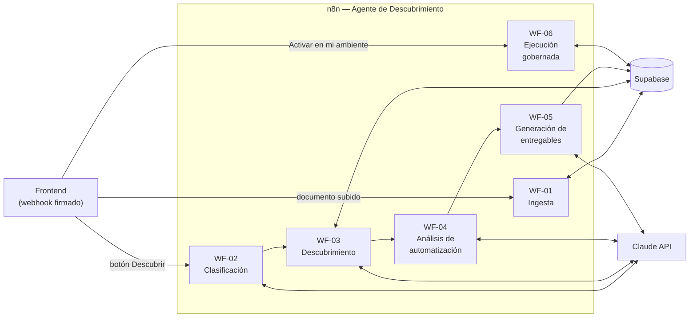
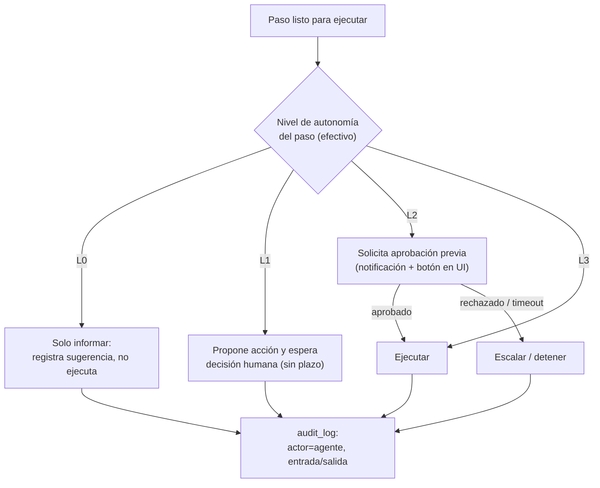

# 03 — Workflows n8n: Especificación del Agente

**Versión:** 1.0 (Piloto) · Agosto 2026
**Contrato central:** el JSON canónico de proceso definido en [02-modelo-de-datos.md §3](02-modelo-de-datos.md). Niveles de autonomía L0–L3 definidos en [05-gobernanza-y-seguridad.md §2](05-gobernanza-y-seguridad.md).

---

## 0. Mapa general

Convención de encadenamiento: WF-02→05 se invocan en cadena mediante el nodo *Execute Workflow* (no webhooks internos), compartiendo el contexto `{organization_id, project_id, agent_run_id}`. Cada workflow actualiza `agent_runs.progress_step/progress_pct` al iniciar y terminar, para que la UI muestre progreso en vivo.

---

## WF-01 — Ingesta de documentos

| | |
|---|---|
| **Trigger** | Webhook `POST /webhook/ingesta` (firma HMAC verificada en el primer nodo) |
| **Entrada** | `{organization_id, project_id, document_id, storage_path}` |
| **Salida** | Chunks vectorizados en `document_chunks`; `documents.status = 'indexado'` |
| **Modelos** | Embeddings `text-embedding-3-small` |

Pasos:
1. **Verificar firma HMAC** → si inválida, responder 401 y terminar.
2. **Actualizar** `documents.status = 'procesando'`.
3. **Descargar** el archivo de Supabase Storage (URL firmada generada con service role).
4. **Extraer texto** según `mime_type`: PDF (nodo Extract From File; si el PDF es escaneado → OCR), DOCX, TXT/MD, EML. Si no se puede extraer → `status='ilegible'` + notificación a la UI, fin.
5. **Chunking**: ~1.000 tokens por chunk con solapamiento de 150; conservar en `metadata` página/sección/encabezados (mejora la trazabilidad de `evidence`).
6. **Embeddings** por lotes (hasta 100 chunks por llamada).
7. **Upsert** en `document_chunks` (clave `document_id + chunk_index`, idempotente: re-procesar un documento no duplica).
8. **Actualizar** `documents.status = 'indexado'` y registrar tokens/costo en `agent_runs`.

**Errores:** reintento automático 3× con backoff en llamadas a APIs; si falla definitivamente → `documents.status='error'` + `error_detail` + fila en `audit_log`.

---

## WF-02 — Clasificación de la solicitud

| | |
|---|---|
| **Trigger** | Webhook `POST /webhook/descubrir` (firma HMAC) — es la entrada de la cadena 02→05 |
| **Entrada** | `{organization_id, project_id, agent_run_id, process_type}` (`process_type` puede ser `'auto'`) |
| **Salida** | `process_type` resuelto; contexto para WF-03 |
| **Modelos** | `claude-haiku-4-5` (tarea barata) |

Pasos:
1. Verificar firma; `agent_runs.status='ejecutando'`.
2. Si `process_type != 'auto'` → pasar directo a WF-03.
3. Si es `'auto'`: muestrear títulos + primeros chunks de los documentos del proyecto → prompt de clasificación contra la taxonomía del piloto: `intake_casos | revision_contratos | respuesta_requerimientos | otro`.
4. Si clasifica `otro` con confianza baja → marcar en el run una advertencia visible en la UI («proceso fuera de la taxonomía del piloto; el descubrimiento será genérico») y continuar con pipeline genérico.
5. Invocar WF-03 con el contexto.

---

## WF-03 — Descubrimiento del proceso

El corazón del agente. Produce el **JSON canónico**.

| | |
|---|---|
| **Trigger** | Execute Workflow desde WF-02 |
| **Salida** | Fila en `processes` (canonical validado) + `process_steps` |
| **Modelos** | `claude-sonnet-5` (extracción y síntesis), embeddings para las consultas RAG |

Estrategia **RAG por aspectos** (no una sola consulta): el workflow interroga la base vectorial con una batería de consultas por dimensión del proceso, usando la función `match_chunks` de [02-modelo-de-datos.md §5](02-modelo-de-datos.md):

1. **Actores y roles** — «¿quién participa, aprueba, recibe?»
2. **Disparadores** — «¿cómo inicia el proceso? ¿qué lo origina?»
3. **Actividades y secuencia** — «pasos, tareas, orden, plazos»
4. **Decisiones y excepciones** — «aprobaciones, rechazos, escalamientos, casos especiales»
5. **Sistemas y documentos** — «herramientas, plantillas, registros usados»
6. **Fin del proceso** — «¿cuándo se considera terminado? ¿qué se entrega?»

Pasos:
1. Actualizar progreso («Recuperando evidencia: actores…», etc.).
2. Para cada aspecto: generar embedding de la consulta (adaptada al `process_type`) → `match_chunks` (top-12) → acumular evidencia con `document_id/chunk_index`.
3. **Síntesis** con `claude-sonnet-5`: prompt con toda la evidencia agrupada por aspecto + el JSON Schema del canónico → produce el proceso completo con `evidence` por paso.
4. **Validación estricta** contra JSON Schema (nodo Code). Si no valida → devolver errores al modelo y reintentar (máx. 2).
5. **Regla de honestidad** (del contrato, §3.2 del modelo de datos): pasos sin evidencia se marcan y se listan en `evidence_gaps`; si > 40% de los pasos carece de evidencia → `kind='to_be'` (el agente declara que está *diseñando*, no *descubriendo*).
6. **Persistir** `processes` + `process_steps`; actualizar progreso; invocar WF-04.

---

## WF-04 — Análisis de automatización

| | |
|---|---|
| **Trigger** | Execute Workflow desde WF-03 |
| **Salida** | `automation` en cada paso del canónico + filas en `automation_assessments` |
| **Modelos** | `claude-sonnet-5` |

Rúbrica de evaluación por paso (se incluye textual en el prompt y se documenta en la UI):

| Dimensión | Escala | Criterio |
|---|---|---|
| `volume_score` | 1–5 | Frecuencia estimada de ejecución (evidencia documental o estimación del tipo de proceso) |
| `repetition_score` | 1–5 | Qué tan regular/basado en reglas es el paso |
| `task_class` | enum | `clasificacion` · `extraccion` · `generacion` · `enrutamiento` · `verificacion` · `juicio_experto` |
| `risk_level` | bajo/medio/alto | Impacto de un error (legal, económico, reputacional) |

Matriz de autonomía sugerida (regla determinística aplicada tras la evaluación del LLM — el nivel no lo decide el modelo directamente):

| | Riesgo bajo | Riesgo medio | Riesgo alto |
|---|---|---|---|
| **Alta repetición + no juicio** | L3 | L2 | L1 |
| **Media repetición** | L2 | L2 | L1 |
| **`juicio_experto`** | L1 | L1/L0 | L0 |

Pasos: evaluar cada paso del canónico (por lotes) → aplicar matriz → escribir `automation` en el JSON + `automation_assessments` → recalcular `metrics_estimate` (minutos automatizables) → invocar WF-05.

---

## WF-05 — Generación de entregables

| | |
|---|---|
| **Trigger** | Execute Workflow desde WF-04 |
| **Salida** | 3 filas en `deliverables` (+ archivos en Storage); `agent_runs.status='completado'` |
| **Modelos** | `claude-sonnet-5` solo para la redacción del SOP; diagrama y workflow se generan **determinísticamente** desde el canónico |

### (a) Diagrama — generación determinística
Nodo Code que transforma `canonical.steps` → **Mermaid flowchart**: nodos por tipo (tarea/decisión/evento), *swimlanes* por actor, y clase CSS por nivel de autonomía sugerido (L3 verde, L2 amarillo, L1 naranja, L0 gris). Sin LLM: el diagrama nunca contradice al canónico.

### (b) SOP as-is / to-be — redacción LLM sobre esqueleto fijo
Estructura fija: Objetivo · Alcance · Roles · Proceso actual (as-is) · Vacíos de evidencia · Proceso propuesto (to-be) · Mapa de automatización con justificación por etapa · Métricas estimadas (ahorro en minutos/mes) · Anexo de evidencia (citas a documentos fuente). El LLM redacta secciones; los datos (pasos, scores, métricas) se inyectan del canónico. Salida a DOCX/PDF → Storage.

### (c) Workflow n8n ejecutable — plantillas + ensamblaje
**No es generación libre de JSON n8n** (frágil). Enfoque de **biblioteca de sub-workflows plantilla** validados a mano, uno por `task_class`:

| `task_class` | Plantilla | Qué hace |
|---|---|---|
| `clasificacion` | `tpl-clasificar` | LLM clasifica el ítem entrante contra categorías configuradas |
| `extraccion` | `tpl-extraer` | LLM extrae campos estructurados de un documento |
| `generacion` | `tpl-generar-doc` | LLM redacta borrador desde plantilla aprobada |
| `enrutamiento` | `tpl-enrutar` | Asigna/deriva según reglas + clasificación |
| `verificacion` | `tpl-verificar` | Checklist automatizada con reporte de hallazgos |
| `juicio_experto` | `tpl-tarea-humana` | Crea tarea para humano y espera (siempre; no se automatiza) |

El ensamblador (nodo Code) recorre los pasos del canónico con `suggested_autonomy ≥ L1`, instancia la plantilla correspondiente, la parametriza (categorías, campos, destinatarios) y **envuelve cada paso en el gate de autonomía de WF-06**. Resultado: JSON de workflow n8n completo, guardado en `deliverables` (no publicado aún).

> Nota de implementación: los workflows WF-01…06 y las plantillas `tpl-*` se construirán desde esta sesión con el **MCP oficial de n8n** (ya conectado), siguiendo su SDK y validadores (`validate_workflow`, `test_workflow`) antes de publicar.

---

## WF-06 — Ejecución gobernada (runtime de autonomía)

| | |
|---|---|
| **Trigger** | Sub-workflow invocado por cada paso de los workflows generados; y webhook `POST /webhook/activar` para publicar un workflow generado |
| **Función** | Hacer cumplir el nivel de autonomía y dejar rastro de auditoría en **cada** acción del agente |

Gate de autonomía (envuelve cada paso automatizado):

Reglas del runtime:
1. **Nivel efectivo** = mín(nivel del paso, nivel elegido al activar, `organizations.max_autonomy`). La degradación se registra.
2. Aprobaciones L2: n8n crea una fila `pending_approval` (tabla ligera o Data Table de n8n) → la UI la muestra en tiempo real → el nodo Wait de n8n espera el callback. Timeout configurable (por defecto 24 h) → escala al administrador.
3. Toda ejecución (L1 sugerida, L2 aprobada, L3 autónoma) escribe en `audit_log` con entrada/salida resumida.
4. Publicación (`/webhook/activar`): valida firma → crea el workflow en n8n vía API interna → `workflow_activations` → tag `tenant:<org_slug>`.

---

## Convenciones de ingeniería n8n

| Tema | Convención |
|---|---|
| **Nombres** | `[CORE] WF-0X Nombre` para el agente; `[TPL] tpl-nombre` para plantillas; `[GEN] <org_slug> — Nombre del proceso vX` para workflows generados |
| **Tags** | `core`, `template`, `tenant:<org_slug>`, `env:dev|prod` |
| **Credenciales** | Solo en el gestor de credenciales de n8n (Supabase service role, Claude API, OpenAI embeddings, secreto HMAC). **Jamás** en nodos Code ni en el JSON exportado |
| **Versionado** | Workflows core y plantillas exportados a JSON en un repo Git (`/n8n/workflows/`); despliegue dev→prod solo desde Git |
| **Errores** | Un *Error Workflow* global: captura fallos de cualquier workflow → `agent_runs.status='error'` + `audit_log` + alerta al operador IA Labs (correo/Telegram) |
| **Idempotencia** | Webhooks aceptan reintentos: `agent_run_id` como clave de deduplicación |
| **Colas** | Piloto: modo regular. Producción: modo `queue` con Redis + workers (ver [07-roadmap-piloto-a-produccion.md](07-roadmap-piloto-a-produccion.md)) |
| **Presupuesto por run** | Cada llamada LLM acumula tokens en `agent_runs`; si `cost_usd` supera el tope (config por org, por defecto USD 5) → abortar con estado claro |
