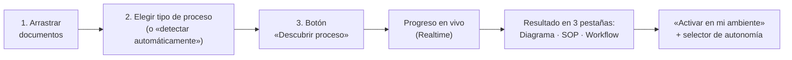
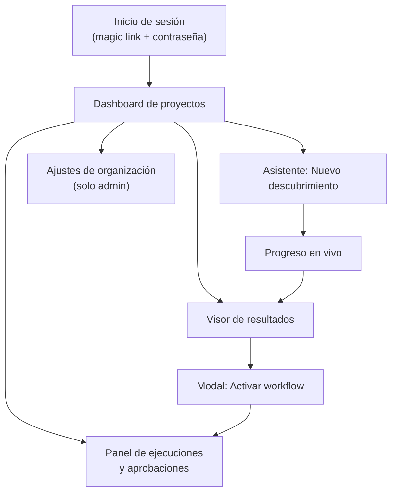

# 04 — Frontend y Experiencia de Usuario

**Versión:** 1.0 (Piloto) · Agosto 2026
**Stack:** Next.js (App Router) en Vercel · Tailwind CSS + shadcn/ui · Supabase JS (auth, datos, Realtime) · PWA instalable · Todo en **español**.
**Principio:** experiencia "one click" — el cliente nunca ve configuración técnica; ve su proceso, su ahorro y un botón.

---

## 1. El flujo "one click"

Del clic en **Descubrir** al resultado no hay ninguna otra decisión que tomar. Todas las opciones avanzadas existen, pero detrás de un «Ajustes avanzados» colapsado.

## 2. Mapa de pantallas

### 2.1 Inicio de sesión
- Supabase Auth: magic link (principal, cero fricción) + correo/contraseña. El usuario llega por invitación de su administrador; no hay registro abierto.
- Marca IA Labs + nombre del producto (placeholder: **«[Nombre del producto] by IA Labs»** — definir en branding).

### 2.2 Dashboard de proyectos
- Tarjetas por proyecto: nombre, tipo de proceso, estado (● descubriendo / ✓ descubierto / ▶ workflow activo), ahorro estimado en horas/mes (de `metrics_estimate`).
- CTA principal grande: **«+ Nuevo descubrimiento»**.
- Banner de aprobaciones pendientes (si hay pasos L2 esperando): «Tienes 3 acciones por aprobar →».

### 2.3 Asistente de nuevo descubrimiento (una sola pantalla)
1. **Zona de arrastre** de documentos (PDF, DOCX, TXT, EML; máx. 25 MB c/u en el piloto). Subida directa a Supabase Storage con URL firmada; miniaturas con estado por archivo (subido → procesando → indexado / ilegible).
2. **Tipo de proceso**: 4 tarjetas ilustradas — *Intake de casos*, *Revisión de contratos*, *Respuesta a requerimientos*, *Detectar automáticamente* (preseleccionada).
3. Botón **«Descubrir proceso»** (deshabilitado hasta que ≥ 1 documento esté indexado).

### 2.4 Progreso en vivo
- Suscripción Realtime a `agent_runs`: barra de progreso + `progress_step` en lenguaje natural («Recuperando evidencia: actores…», «Analizando automatización: paso 4 de 9…»).
- El usuario puede salir; recibe el estado al volver (y en producción, notificación push al terminar).

### 2.5 Visor de resultados — 3 pestañas
| Pestaña | Contenido | Acciones |
|---|---|---|
| **Diagrama** | Mermaid renderizado con colores por autonomía (L3 verde · L2 amarillo · L1 naranja · L0 gris) + leyenda; clic en un paso abre su detalle: evidencia citada, scores, justificación (`rationale`) | Exportar PNG/SVG |
| **SOP** | Vista del documento as-is/to-be con los vacíos de evidencia resaltados | Descargar DOCX/PDF |
| **Workflow** | Vista simplificada del flujo n8n generado (pasos + gates de autonomía); **no** el editor n8n | **«Activar en mi ambiente»** |
- Cabecera común: nombre del proceso, tipo (as-is / to-be con explicación), métrica destacada «≈ N horas/mes automatizables», botón «Validar descubrimiento» (registra `validated_by` — criterio de éxito del piloto).

### 2.6 Modal «Activar en mi ambiente»
- Selector de nivel de autonomía con lenguaje claro:
  - **L0 — Solo observar:** el agente sugiere, nunca actúa.
  - **L1 — Proponer:** el agente prepara cada acción y espera tu decisión.
  - **L2 — Ejecutar con aprobación:** el agente actúa tras tu aprobación paso a paso. *(recomendado, preseleccionado)*
  - **L3 — Autónomo:** el agente actúa solo; todo queda auditado.
- Niveles por encima del techo de la organización aparecen bloqueados con nota «Deshabilitado por tu administrador».
- Confirmación explícita → webhook `/webhook/activar` → estado «Workflow activo» en el dashboard.

### 2.7 Panel de ejecuciones y aprobaciones
- **Aprobaciones (L2):** lista de acciones pendientes con contexto (qué quiere hacer el agente, con qué entrada, resultado propuesto) y botones **Aprobar / Rechazar** (con motivo). Tiempo real.
- **Historial:** ejecuciones del agente y de los workflows activos, con filtros; vista de detalle enlazada a `audit_log`.

### 2.8 Ajustes de organización (admin)
- Miembros e invitaciones (roles admin/member).
- **Techo de autonomía** (`max_autonomy`) con explicación de impacto.
- Retención de datos y botón de exportación/borrado (ver [05-gobernanza-y-seguridad.md](05-gobernanza-y-seguridad.md)).

## 3. Estados vacíos, errores y honestidad del agente

| Situación | Experiencia |
|---|---|
| Documento ilegible | Miniatura en rojo con «No pudimos leer este archivo» + sugerencia (¿escaneado? probar con OCR en fase 2) — el descubrimiento puede continuar con el resto |
| Evidencia insuficiente | Banner ámbar en resultados: «Diseñamos este proceso (to-be) porque los documentos no describen el proceso actual completo. Vacíos detectados: …» — nunca se presenta un diseño como descubrimiento |
| Ejecución fallida | Estado de error con explicación en lenguaje claro + botón «Reintentar» + aviso automático al soporte de IA Labs |
| Presupuesto del run excedido | «El análisis superó el límite de costo configurado; contacta a tu administrador» |
| Sin proyectos aún | Onboarding de 3 pasos ilustrando el flujo one-click |

## 4. Decisiones de implementación

- **Renderizado de diagramas:** `mermaid` en cliente con estilos propios; export vía SVG.
- **Subida de archivos:** Supabase Storage con URL firmadas desde Server Action (el navegador nunca toca la service role).
- **Tiempo real:** canal Realtime por `project_id` sobre `agent_runs` y `pending_approvals`.
- **PWA:** manifest + service worker (next-pwa); objetivo: instalable en móvil y escritorio, con la pantalla de aprobaciones como caso de uso móvil principal.
- **Accesibilidad e idioma:** es-CL/es-419 neutro; los textos del agente (rationale, SOP) ya se generan en español desde los prompts.
- **Diseño:** tema claro/oscuro, tipografía y paleta de IA Labs (pendiente manual de marca; usar tokens de diseño desde el inicio para no re-trabajar).
