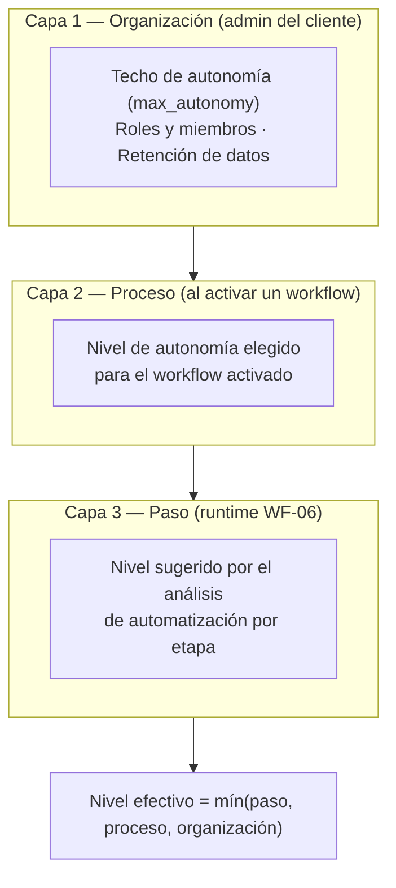

# 05 — Gobernanza y Seguridad

**Versión:** 1.0 (Piloto) · Agosto 2026
**Principio rector:** «con responsabilidad» — el agente solo tiene la autonomía que el cliente le concede, todo queda auditado, y los datos del cliente son del cliente.

---

## 1. Modelo de gobernanza en tres capas

## 2. Niveles de autonomía (contrato del producto)

Definición única para todo el sistema — la UI, los workflows y la auditoría usan exactamente estos niveles:

| Nivel | Nombre | Comportamiento del agente | Registro |
|---|---|---|---|
| **L0** | Solo observar | Analiza y **sugiere**; nunca ejecuta acciones | Sugerencia en `audit_log` |
| **L1** | Proponer | Prepara cada acción con su resultado propuesto y **espera decisión humana** sin plazo | Propuesta + decisión |
| **L2** | Ejecutar con aprobación | Solicita **aprobación previa por paso** (notificación + botón); timeout 24 h → escala al admin | Solicitud + aprobación/rechazo + ejecución |
| **L3** | Autónomo | Ejecuta sin intervención; **auditoría posterior** completa | Entrada/salida de cada ejecución |

Reglas transversales:
1. Tareas clasificadas `juicio_experto` **nunca** superan L1, sin importar la configuración (regla dura en WF-04 y WF-06). En el vertical legal esto protege el criterio profesional del abogado.
2. Si el nivel solicitado supera el techo de la organización, se **degrada** al techo y la degradación queda en `audit_log`.
3. Cambiar el techo de la organización requiere rol `admin` y queda auditado.
4. Cualquier workflow activo puede **pausarse con un clic** desde el panel de ejecuciones (kill switch por workflow); el operador IA Labs tiene kill switch global por tenant.

## 3. Multi-tenancy y aislamiento

| Capa | Mecanismo de aislamiento |
|---|---|
| Base de datos | RLS en todas las tablas de negocio con `is_member_of(organization_id)` — ver [02-modelo-de-datos.md §4](02-modelo-de-datos.md) |
| Vectores (RAG) | Los chunks viven en la misma base bajo RLS; las consultas `match_chunks` filtran por proyecto del tenant |
| Storage | Carpetas `org_id/...` con políticas equivalentes; URLs firmadas de corta duración |
| n8n (piloto) | Instancia compartida con aislamiento lógico: todo payload lleva `organization_id` firmado; workflows generados etiquetados `tenant:<org_slug>`; los workflows validan tenant en el primer nodo |
| n8n (producción) | Camino a instancia n8n **dedicada por cliente** enterprise (misma imagen Docker, un contenedor por tenant) — elimina el riesgo de cruce en la capa de orquestación |
| Realtime | Canales por `project_id`; políticas RLS aplican también a las suscripciones |

## 4. Seguridad técnica

### Identidad y acceso
- Supabase Auth; invitación cerrada (sin registro abierto). Magic link + contraseña; 2FA para el rol `admin` y para operadores IA Labs (fase de producción).
- Llave `anon` en el navegador (limitada por RLS); llave `service_role` **solo** en credenciales n8n y variables de entorno del servidor. Rotación semestral o ante sospecha.
- UI de n8n: autenticación propia + 2FA; sin acceso de clientes (los clientes ven n8n solo a través de la plataforma).

### Red y transporte
- TLS extremo a extremo (Vercel y Caddy con certificados automáticos).
- VPS endurecido: solo 80/443 públicos; SSH con llave y sin root remoto; firewall (ufw) + fail2ban; actualizaciones de seguridad automáticas del SO.
- Webhooks frontend→n8n firmados con **HMAC-SHA256** + timestamp (ventana de 5 min contra replay). n8n verifica firma y tenant en el primer nodo de cada webhook.

### Secretos
| Secreto | Dónde vive |
|---|---|
| Claude API key, OpenAI embeddings key | Credenciales n8n (cifradas con `N8N_ENCRYPTION_KEY`) |
| Supabase service role | Credencial n8n |
| Secreto HMAC | Vercel env + credencial n8n |
| `N8N_ENCRYPTION_KEY`, contraseñas de Postgres | Archivo `.env` del VPS (permisos 600) + copia en gestor de contraseñas de IA Labs |

Regla: ningún secreto en Git, en nodos Code, ni en el JSON exportado de workflows (los exports de n8n excluyen credenciales por diseño; verificar en el pipeline de despliegue).

## 5. Datos del cliente y confidencialidad legal

Compromisos de producto (van al contrato de servicio y a la página de confianza):

1. **No entrenamiento:** los datos del cliente jamás se usan para entrenar modelos. Las APIs de Claude y OpenAI se usan en modalidad API estándar (sin retención para entrenamiento); documentar los términos vigentes de cada proveedor en el DPA.
2. **Minimización:** a los LLMs solo viajan los chunks recuperados para la tarea, no repositorios completos.
3. **Retención y borrado:** el admin del cliente puede exportar todo (documentos, procesos, entregables, auditoría) y solicitar borrado completo del tenant; SLA de borrado: 30 días incluyendo backups.
4. **Secreto profesional (vertical legal):** los documentos pueden estar cubiertos por secreto profesional abogado-cliente. Implicaciones: cifrado en reposo (Supabase y volúmenes del VPS), acceso del personal de IA Labs solo bajo ticket de soporte con consentimiento y auditado, y cláusula de confidencialidad reforzada en el contrato.
5. **Residencia de datos:** elegir región de Supabase y del VPS coherentes con el mercado del piloto (p. ej. `sa-east-1` / datacenter en Sudamérica si el cliente lo requiere); documentar en el DPA.
6. **DPA modelo:** anexo de tratamiento de datos con: roles (cliente = responsable, IA Labs = encargado), subencargados (Supabase, Vercel, proveedor VPS, Anthropic, OpenAI), medidas técnicas (este documento), y procedimiento ante incidentes.

## 6. Auditoría

- `audit_log` **append-only** (sin UPDATE/DELETE para roles de aplicación), con `actor_type` (usuario/agente/sistema), acción, recurso y payload resumido de entrada/salida.
- Eventos mínimos auditados: inicio de sesión, carga y borrado de documentos, cada run del agente, cada sugerencia/propuesta/aprobación/rechazo/ejecución de los niveles L0–L3, activación/pausa de workflows, cambios de techo de autonomía, cambios de miembros, accesos de soporte de IA Labs.
- Visible para el cliente: panel de auditoría filtrable en la UI (transparencia = confianza = adopción).
- Retención de auditoría: mínimo 12 meses en el piloto.

## 7. Riesgos de IA y salvaguardas específicas

| Riesgo | Salvaguarda |
|---|---|
| Alucinación en el descubrimiento | Regla de honestidad del canónico: sin evidencia → `to_be` + `evidence_gaps` explícitos (WF-03); citas a documentos fuente por paso |
| Workflow generado incorrecto | Ensamblaje desde plantillas validadas, nunca JSON libre; validación `validate_workflow` antes de publicar; primer estado siempre requiere activación humana |
| Acción autónoma dañina | Matriz de autonomía con techo por riesgo; `juicio_experto` capado a L1; kill switch por workflow y por tenant; presupuesto de costo por run |
| Inyección de prompts vía documentos del cliente | Los documentos se tratan como **datos**: los prompts del agente instruyen explícitamente ignorar instrucciones embebidas en la evidencia; los workflows generados no conceden herramientas fuera de su plantilla |
| Deriva de calidad de prompts | Prompts versionados en Git junto a los workflows; set de regresión con 3 procesos de referencia antes de cada cambio |
