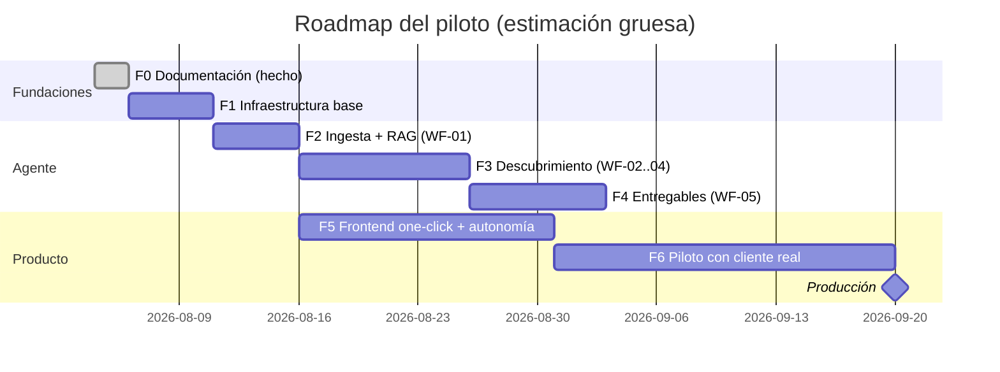

# 07 — Roadmap: del Piloto a Producción

**Versión:** 1.0 · Agosto 2026
**Lectura:** cada fase tiene hitos verificables y un **criterio de salida** — no se avanza a la siguiente sin cumplirlo. Esfuerzos estimados para un equipo de 1–2 personas con asistencia de agentes de IA (esta misma sesión de Claude Code + MCP de n8n, Supabase y Vercel ya conectados).

*(F5 corre en paralelo con F3–F4: el frontend consume contratos ya definidos en la documentación.)*

---

## F0 — Documentación ✅ (esta ejecución)
Suite 00–07 completa en este directorio. **Criterio de salida:** revisión y visto bueno del usuario sobre visión (00) y este roadmap (07).

## F1 — Infraestructura base (≈ 1 semana)
| Hito | Verificación |
|---|---|
| VPS contratado y endurecido (SSH llave, firewall, fail2ban) | Checklist de [05](05-gobernanza-y-seguridad.md) §4 completada |
| n8n + Postgres + Caddy con Docker Compose y TLS | UI de n8n accesible por HTTPS con 2FA |
| Proyecto Supabase creado; migraciones del [modelo de datos](02-modelo-de-datos.md) aplicadas | Tablas + RLS verificadas con dos usuarios de orgs distintas (no se ven entre sí) |
| Repo Git (frontend + `/n8n/workflows` + `/supabase/migrations`) y deploy Vercel conectado | Deploy automático de un esqueleto Next.js |
| Credenciales n8n cargadas (Claude, embeddings, Supabase, HMAC) | Workflow de prueba llama a cada API |

**Criterio de salida:** un webhook firmado de prueba viaja frontend→n8n→Supabase y escribe una fila.

## F2 — Ingesta + RAG (≈ 1 semana)
| Hito | Verificación |
|---|---|
| WF-01 completo (PDF/DOCX/TXT/EML, chunking, embeddings, idempotencia) | 20 documentos legales de prueba quedan `indexado`; re-proceso no duplica |
| `match_chunks` afinada | Consultas de prueba devuelven pasajes relevantes (revisión manual con 10 preguntas) |
| Manejo de ilegibles y errores | Documento corrupto termina en `ilegible` con mensaje claro |

**Criterio de salida:** corpus del piloto indexado; recuperación semántica validada a mano.

## F3 — Agente de descubrimiento (≈ 2 semanas)
| Hito | Verificación |
|---|---|
| WF-02 clasificación (incl. `auto` y advertencia `otro`) | 10 casos de prueba clasifican correcto ≥ 9 |
| WF-03 descubrimiento con RAG por aspectos + JSON canónico validado por Schema | Los 3 procesos del piloto producen canónicos válidos con `evidence` por paso |
| Regla de honestidad (`to_be` + `evidence_gaps`) | Corpus incompleto a propósito produce `to_be`, nunca un falso as-is |
| WF-04 análisis + matriz de autonomía determinística | `juicio_experto` nunca sugiere > L1 (test automático) |

**Criterio de salida:** el dueño del proceso (o el propio usuario en esta fase) valida ≥ 80% de las etapas de un proceso descubierto real.

## F4 — Entregables (≈ 1.5 semanas)
| Hito | Verificación |
|---|---|
| Diagrama Mermaid determinístico con capa de autonomía | Renderiza para los 3 procesos; colores por nivel correctos |
| SOP DOCX/PDF con esqueleto fijo y citas de evidencia | Documento legible aprobado por el usuario |
| Biblioteca de plantillas `tpl-*` (6) validadas con `validate_workflow` | Cada plantilla pasa test unitario en n8n |
| Ensamblador de workflow + gates WF-06 | Workflow generado para un proceso real ejecuta en n8n con < 15 min de ajuste manual |
| WF-06 runtime completo (nivel efectivo, aprobaciones L2 con Wait/callback, `audit_log`) | Test de los 4 niveles: L0 no ejecuta; L1 espera; L2 aprueba/rechaza/timeout; L3 ejecuta y audita |

**Criterio de salida:** los 3 entregables se generan end-to-end desde un solo clic (vía webhook) en < 10 minutos.

## F5 — Frontend one-click + autonomía (≈ 3 semanas, en paralelo desde F2)
| Hito | Verificación |
|---|---|
| Auth por invitación + dashboard + asistente de descubrimiento | Flujo completo usable en móvil (PWA instalada) |
| Progreso en vivo (Realtime) | La barra refleja `progress_step` real durante un run |
| Visor de 3 pestañas + detalle de paso con evidencia | Clic en paso muestra citas del documento fuente |
| Modal de activación con niveles y techo de org | Nivel bloqueado por techo aparece deshabilitado |
| Panel de aprobaciones L2 en tiempo real | Aprobación desde el móvil desbloquea el nodo Wait de n8n |
| Panel de auditoría | Toda acción del test de F4 aparece en el panel |

**Criterio de salida:** demo completa de 15 minutos sin tocar nada técnico, de documentos a workflow activo.

## F6 — Piloto con cliente legal real (≈ 4 semanas)
1. **Semana 1:** onboarding del cliente (org, usuarios, techo de autonomía, DPA firmado), carga de documentos reales.
2. **Semanas 2–3:** descubrimiento de los 3 procesos objetivo; sesiones de validación con el dueño de cada proceso; iteración de prompts/plantillas.
3. **Semana 4:** activación de ≥ 1 workflow en operación real (empezando en L1/L2); medición de criterios de éxito.

**Criterio de salida = criterios de éxito del piloto** ([00](00-vision-y-alcance.md) §5): 3 procesos validados ≥ 80%, workflow activo en uso real, < 10 min, < USD 3/descubrimiento.

## Producción (post-piloto)
Umbrales que activan cada palanca (de [06](06-costos-y-operacion.md) §4):

| Señal | Acción |
|---|---|
| Cliente pagando / uso comercial | Vercel Pro + Supabase Pro (si no se hizo en F6) + dominio definitivo de la marca |
| > ~50 ejecuciones concurrentes o colas visibles | n8n modo `queue` (Redis + workers) |
| Cliente enterprise con requisitos de aislamiento | Instancia n8n dedicada por tenant |
| > 3 clientes activos | Onboarding self-service, página de confianza/seguridad pública, soporte con SLA |
| Demanda de fuentes nuevas | Fase 2 del producto: entrevista conversacional guiada; luego process mining desde event logs |
| App móvil demandada | Notificaciones push web primero; nativa solo si el uso lo justifica |

Pendientes de decisión de negocio (no bloquean el piloto): nombre del producto y manual de marca, pricing (por descubrimiento, por workflow activo o suscripción), y jurisdicción/residencia de datos según primer cliente.
