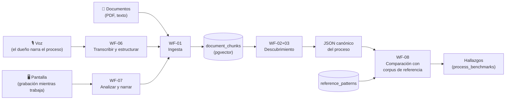

# 08 — Fuentes Multimodales de Descubrimiento y Corpus de Referencia

**Versión:** 1.0 · Agosto 2026
**Estado:** esquema de datos aplicado ✅ · workflows por construir
**Complementa a:** [00-vision-y-alcance.md](00-vision-y-alcance.md) (amplía las fuentes del piloto) y [03-workflows-n8n.md](03-workflows-n8n.md)

---

## 1. Decisión de arquitectura (la más importante de este documento)

Las tres fuentes de entrada —**documentos, voz y grabación de pantalla**— **no** son pipelines paralelos. Todas convergen en la misma tabla `documents` con su texto extraído, se trocean y vectorizan igual, y alimentan el mismo agente de descubrimiento.

**Por qué así:** el JSON canónico es el contrato del producto ([02 §3](02-modelo-de-datos.md)). Si cada fuente tuviera su propio pipeline de descubrimiento, tendríamos tres agentes que mantener y tres formas de derivar hacia resultados inconsistentes. Con esta convergencia, agregar una fuente nueva es agregar un traductor —no un agente.

**Consecuencia práctica:** WF-02+03, WF-04 y WF-05 **no se modifican** al agregar voz o pantalla. Ya funcionan.

## 2. Trazabilidad y honestidad en fuentes derivadas

La regla de honestidad ([05 §7](05-gobernanza-y-seguridad.md)) se vuelve más delicada cuando el texto lo generó un modelo (transcripción, narrativa de video) y no un humano. Reglas duras:

1. `documents.transcript_raw` conserva **siempre** la transcripción cruda, sin refinar. El texto refinado por LLM nunca la reemplaza — se guarda aparte.
2. Las citas de evidencia (`evidence[].quote`) del proceso descubierto apuntan al texto indexado; en la UI, un documento de origen `voz` o `pantalla` se muestra **con distintivo visual** y con acceso al audio/video original y a la transcripción cruda.
3. El SOP y el diagrama declaran el origen de cada evidencia. Un proceso sostenido solo por narración oral **no** tiene el mismo peso probatorio que uno sostenido por un manual firmado, y el entregable debe decirlo.
4. `source_metadata` guarda la confianza de transcripción, el modelo usado y su versión.

## 3. WF-06 — Descubrimiento por voz

**Caso de uso:** el dueño del proceso no tiene documentación, pero sabe cómo funciona. Habla 5–10 minutos describiéndolo.

| | |
|---|---|
| **Entrada** | Audio (webm/mp3/m4a) subido a Storage desde el navegador (MediaRecorder API) |
| **Salida** | Un `documents` con `source_type='voz'`, texto refinado indexado, audio original conservado |
| **Modelos** | Whisper (`whisper-1`, ~USD 0.006/min) para transcribir · `claude-haiku-4-5` para estructurar |

**Pasos:**
1. Webhook recibe `{project_id, storage_path}` → crea `documents` con `source_type='voz'`, `status='procesando'`.
2. Descarga el audio de Storage → `POST api.openai.com/v1/audio/transcriptions` (Whisper, `language=es`).
3. Guarda la transcripción cruda en `transcript_raw` (evidencia original, intocable).
4. **Refinamiento con Haiku** — y aquí está el matiz importante: el prompt **no** debe "mejorar" el contenido inventando. Su instrucción es: corregir puntuación y muletillas, organizar en secciones por tema, y **marcar explícitamente con `[impreciso]` toda afirmación ambigua o incompleta** en vez de completarla. Lo que el narrador no dijo, no existe.
5. El texto refinado entra al pipeline normal: chunking → embeddings → `document_chunks`.
6. `status='indexado'` + auditoría.

**Guion sugerido en la UI** (mejora mucho la calidad del insumo — se muestra al usuario mientras graba):
> «Cuéntame: ¿cómo empieza este proceso? ¿quién hace qué, y en qué orden? ¿qué decisiones o excepciones aparecen? ¿qué sistemas usas? ¿cuándo lo das por terminado?»

Esas cinco preguntas espejean los 6 aspectos del RAG, así la narración cubre lo que el descubridor va a buscar.

## 4. WF-07 — Descubrimiento por grabación de pantalla

**Caso de uso:** el proceso vive en la operación diaria, no en papel. El usuario graba su pantalla mientras ejecuta el proceso una vez.

| | |
|---|---|
| **Entrada** | Video (webm) desde `navigator.mediaDevices.getDisplayMedia()` + audio opcional del narrador |
| **Salida** | Un `documents` con `source_type='pantalla'`, narrativa del proceso indexada |
| **Modelos** | Claude Sonnet 5 (visión) para leer fotogramas · Whisper si hay audio |

**El desafío real es el costo:** un video de 10 minutos a 30 fps son 18.000 fotogramas. Analizarlos todos sería absurdo (miles de dólares). La estrategia:

1. **Muestreo inteligente por cambio de escena**, no por tiempo fijo. Extraer fotogramas solo cuando la pantalla cambia significativamente (ffmpeg `select='gt(scene,0.3)'`), con un tope de ~40 fotogramas por video. Un proceso de 10 minutos suele tener 15–30 pantallas distintas.
2. Cada fotograma se redimensiona a ≤1.100px de ancho (más resolución no mejora la lectura de UI y multiplica el costo).
3. Se envían en **lotes de 8–10 fotogramas** con su marca de tiempo a Claude, pidiendo: qué aplicación/pantalla es, qué acción realiza el usuario, qué datos maneja.
4. Si hay audio, Whisper lo transcribe y se entrega **junto** con los fotogramas: la narración explica el *por qué* que la pantalla no muestra.
5. Una llamada final consolida los lotes en una narrativa secuencial del proceso → ese texto entra al pipeline normal.

**Costo estimado:** ~40 fotogramas ≈ 60k tokens de visión ≈ **USD 0.20–0.30 por video de 10 min**. Aceptable.

**Advertencia de privacidad (obligatoria en la UI, no negociable):** una grabación de pantalla puede capturar datos de clientes, expedientes, correos y credenciales visibles. Antes de grabar, la interfaz debe advertirlo explícitamente y recomendar cerrar lo que no sea parte del proceso. En un vertical legal esto toca secreto profesional: el video se almacena cifrado, con retención más corta que los documentos (sugerido: 30 días, configurable), y el usuario puede borrarlo conservando la narrativa derivada.

## 5. WF-08 — Comparación contra el corpus de referencia

**Qué es:** una vez descubierto el proceso, compararlo contra patrones de referencia de procesos empresariales para responder *«¿esto se parece a cómo lo hacen los buenos?»*.

**De dónde sale el corpus — con honestidad sobre las fuentes:**

| Fuente | Naturaleza | Uso |
|---|---|---|
| **APQC Process Classification Framework** | Taxonomía pública de procesos por industria | Estructura y nomenclatura de procesos |
| **BPM CBOK / BPMN 2.0** | Cuerpo de conocimiento y notación estándar | Patrones de modelado, tipos de tarea |
| **Lean / Six Sigma** | Metodologías públicas | Detección de desperdicios: esperas, retrabajos, traspasos innecesarios |
| **ISO 9001 / ITIL** | Normas de gestión | Controles esperados, trazabilidad, mejora continua |
| **Experiencia propia de IA Labs** | Patrones observados en clientes reales | Diferenciador acumulativo del producto |

**Advertencia importante y deliberada:** el sistema **no** consulta bases de datos propietarias ni benchmarks comerciales de terceros que IA Labs no tenga licenciados. `reference_patterns.source_citation` es obligatorio y se muestra en cada hallazgo: el cliente siempre ve de dónde sale la recomendación. Cuando un patrón proviene de la experiencia de IA Labs y no de un marco publicado, se declara así. Un benchmark sin fuente citable no entra al corpus.

**Cómo funciona:**
1. Se genera un embedding del resumen del proceso descubierto.
2. `match_reference_patterns()` trae los 4 patrones más afines de la taxonomía.
3. Claude Sonnet compara el canónico contra esos patrones y emite hallazgos tipificados en `process_benchmarks`:
   - `paso_faltante` — el marco espera un control que el proceso no tiene (ej.: no hay verificación de conflicto de interés en un intake legal)
   - `paso_adicional` — pasos sin equivalente en el marco (candidatos a desperdicio, o a diferenciador legítimo)
   - `desviacion` — el orden o el responsable difiere de la práctica recomendada
   - `buena_practica` — el proceso ya cumple algo que vale reconocer
   - `riesgo` — brecha con implicación legal/normativa
4. Cada hallazgo lleva `severity`, `recommendation` y `source_citation`.

**Regla de gobernanza:** los hallazgos son **insumo para decisión humana, nunca acción automática**. Un hallazgo jamás modifica el proceso descubierto ni dispara automatización por sí solo — se presentan al dueño del proceso, que decide. Esto es coherente con los niveles de autonomía: la comparación es siempre **L0 (solo informa)**.

## 6. Estado de implementación

| Componente | Estado |
|---|---|
| Esquema de datos (`documents.source_type`, `transcript_raw`, `reference_patterns`, `process_benchmarks`, `match_reference_patterns`) | ✅ Aplicado en Supabase |
| WF-06 Voz | ✅ **Construido y publicado** — `[CORE] WF-06 Descubrimiento por Voz`, id `1drZWkusLtn7ZEzi`, webhook `POST .../webhook/piloto-voz` con payload `{project_id, storage_path, filename}`. Pendiente: prueba end-to-end con audio real |
| WF-07 Pantalla | Especificado, por construir |
| WF-08 Comparación con referencia | Especificado; requiere sembrar el corpus primero |
| Captura en el frontend (MediaRecorder / getDisplayMedia) | Parte de F5 |

**Orden recomendado:** WF-06 (voz) primero — es el de mayor relación valor/esfuerzo y resuelve el caso más común del piloto legal (el cliente que no tiene documentación pero sí sabe su proceso). WF-07 y WF-08 después.
